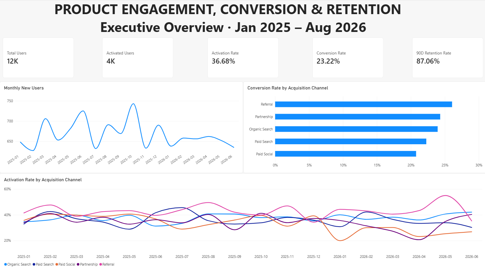
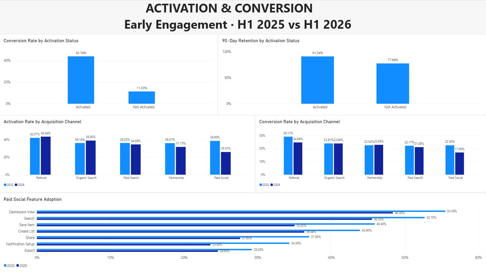

# Product Engagement, Conversion & Retention Analysis
🌐 Language: **English** | [Español](README_ES.md)
## Executive Summary

This end-to-end Product Analytics project investigates whether acquired users are becoming engaged, converting into paying customers, and remaining subscribed over time.

The analysis found that overall acquisition remained relatively stable, but user quality differed significantly across acquisition channels.

The clearest deterioration appeared in **Paid Social during H1 2026**:

- Activation rate fell from **38.6% to 25.9%**
- Conversion rate fell from **22.5% to 17.0%**
- Acquisition volume remained almost unchanged (**1,000 vs 988 users**)

Across the full user base, **activated users converted 3.86x more often** than non-activated users and had a **13.55 percentage point higher 90-day retention rate**.

These findings suggest that improving early product engagement — particularly among Paid Social users — should be a priority for further investigation.

---

## Business Problem

Product Management wants to understand whether acquired users are becoming valuable, engaged and retained customers.

The analysis focuses on three questions:

1. Are acquisition channels generating users who successfully activate and convert?
2. How strongly is early product engagement associated with conversion and retention?
3. Where has product performance weakened, and what should the business investigate next?

Analysis period: **January 2025 – August 2026**

---

## Dataset

This project uses a **synthetic relational dataset** designed to simulate a digital product environment.

The dataset contains:

- **12,000 users**
- **73,151 sessions**
- **307,067 raw product events**
- **2,786 subscriptions**
- **1,162 support tickets**

Main entities:

- Users
- Sessions
- Product Events
- Subscriptions
- Support Tickets

The dataset intentionally includes several data-quality issues so that validation and cleaning are part of the analytical workflow.

---

## Methodology

### 1. Data Quality & Preparation

The raw data was loaded into PostgreSQL and validated before analysis.

The audit identified:

- **100 duplicate event records**
- **60 missing country values**
- **40 missing signup-device values**

A clean analytics layer was created using PostgreSQL views.

Duplicate events were removed using `ROW_NUMBER()`, while missing categorical values were standardized as `Unknown`.

---

### 2. User-Level Analytical Model

A user-level analytical view was created with one row per user.

Metrics included:

- Sessions during the first 7 days
- Distinct product features used during the first 7 days
- Activation status
- Conversion status
- Subscription information
- 90-day retention eligibility
- 90-day retention status

### Activation Definition

A user was classified as **Activated** when they completed:

- At least **2 sessions**
- At least **3 distinct product features**

during their first **7 days after signup**.

### Retention Definition

Retention was measured using **90-day subscription retention**.

Only subscriptions old enough to have completed the full 90-day observation window were included.

---

## Key Findings

### 1. Acquisition was stable rather than growing

Monthly new-user acquisition remained approximately between **630 and 740 users**.

This challenged the initial assumption that acquisition was experiencing sustained growth and shifted the investigation toward **acquisition quality rather than acquisition volume**.

---

### 2. Activation is strongly associated with conversion

| User Segment | Conversion Rate |
|---|---:|
| Activated | **43.74%** |
| Not Activated | **11.33%** |

Activated users converted approximately **3.86x more often**.

However, only **36.68% of users activated**, making early engagement an important area for product investigation.

---

### 3. Activation is also associated with stronger retention

Among subscriptions eligible for the 90-day retention analysis:

| User Segment | 90-Day Retention |
|---|---:|
| Activated | **91.24%** |
| Not Activated | **77.69%** |

Activated users showed a **13.55 percentage point higher 90-day retention rate**.

This does not establish causality, but it provides evidence that early engagement is associated with stronger downstream customer outcomes.

---

### 4. Paid Social deteriorated significantly in H1 2026

Paid Social acquisition volume remained almost unchanged:

**H1 2025:** 1,000 users  
**H1 2026:** 988 users

However:

| Metric | H1 2025 | H1 2026 | Change |
|---|---:|---:|---:|
| Activation Rate | 38.60% | 25.91% | **-12.69 pp** |
| Conversion Rate | 22.50% | 17.00% | **-5.50 pp** |

This suggests that the main issue was not the number of users acquired, but what happened **after acquisition**.

---

### 5. Early engagement weakened across the Paid Social journey

Paid Social users also showed weaker early product behaviour.

Average sessions during the first 7 days declined approximately **24.3%**, while average distinct features used declined approximately **19.4%**.

Feature adoption decreased across all seven tracked product behaviours, including:

- Dashboard View
- Search
- Save Item
- Create List
- Share
- Notification Setup
- Export

Because the deterioration occurred across multiple behaviours, the evidence points toward a **broad early-engagement problem rather than a single underperforming feature**.

---

## Business Recommendations

### Investigate Paid Social acquisition quality

Review campaign targeting, audience composition and campaign mix to determine whether H1 2026 campaigns attracted users with weaker product intent.

### Investigate the post-acquisition experience

Evaluate the onboarding and first-week experience of Paid Social users to identify friction preventing users from reaching activation.

### Monitor activation by acquisition cohort

Activation should be monitored alongside acquisition volume and conversion rather than evaluating channels only by the number of users acquired.

### Focus on broad early engagement

Because feature adoption declined across the product rather than in one isolated feature, improvements should initially focus on the overall early-user journey.

---

## Limitations

- The dataset is synthetic and represents a simulated business scenario.
- The analysis identifies **associations, not causal relationships**.
- Advertising spend, CAC, campaign targeting and creative data are unavailable.
- Therefore, channel profitability cannot be evaluated.
- 90-day retention analysis only includes subscriptions with a complete observation window.
- The activation definition is an analytical business rule and would require further validation in a real product environment.

---

## Next Steps

With additional data, the analysis could be extended by:

- Connecting acquisition costs to customer outcomes
- Analysing Paid Social campaigns and audience segments
- Investigating onboarding steps before activation
- Running experiments to test improvements to early engagement
- Evaluating longer-term customer value and retention

---

## Dashboard

### Executive Overview

### Activation & Conversion Analysis

---

## Tools & Skills

**PostgreSQL**
- Data validation and cleaning
- Joins
- CTEs
- Conditional logic
- Aggregations
- Window functions
- Analytical views

**Excel / Power Query**
- Data import
- Validation
- KPI reconciliation
- PivotTables

**Power BI**
- Data modeling
- DAX measures
- KPI development
- Cohort comparison
- Interactive reporting
- Dashboard design

---

## Repository Files

- `Product_Engagement_Conversion_Retention_Analysis.pbix` — Power BI report
- `Product_Engagement_Conversion_Retention_Analysis.xlsx` — Excel validation workbook
- `executive_overview.png` — Executive dashboard
- `activation_conversion.png` — Activation & conversion dashboard
